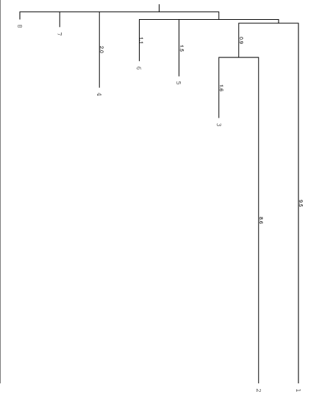
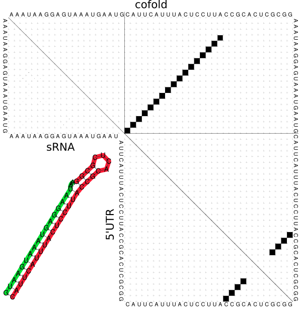
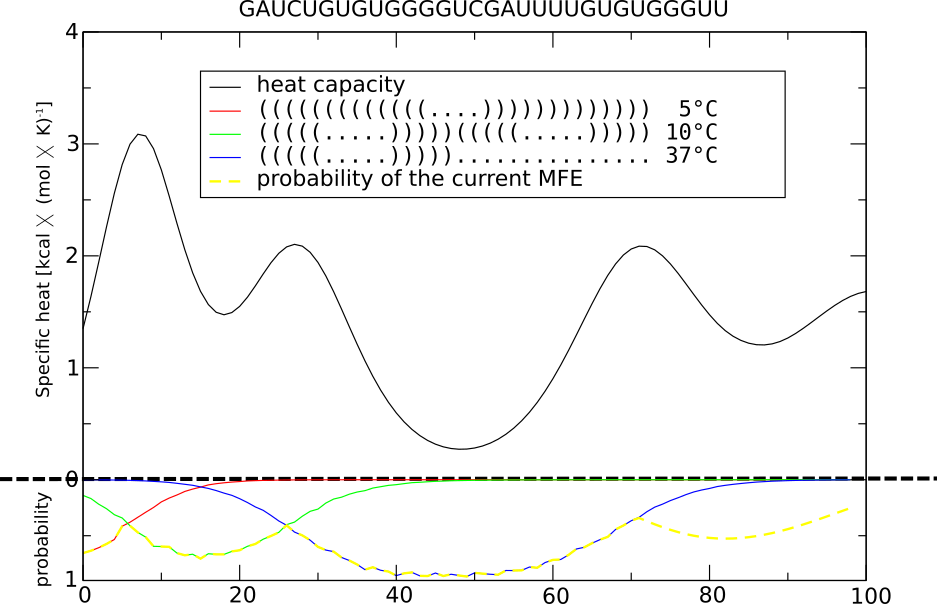
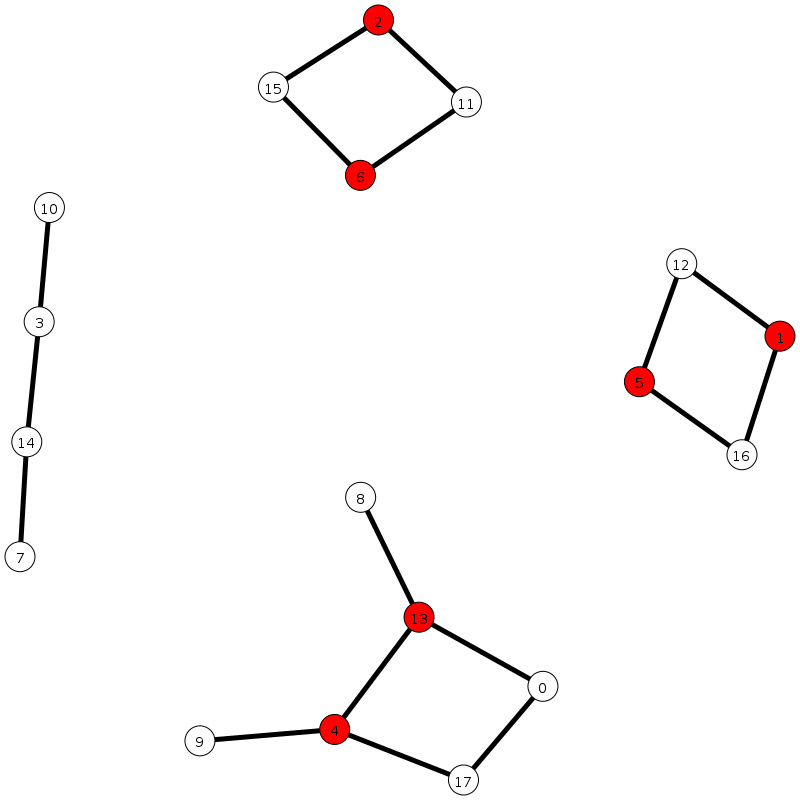

RNAsketch Library for designing RNA molecules
============================================

Installation
------------

Download the lastes RNAsketch package from https://github.com/ribonets/RNAsketch/releases/latest, exctract and simply use setuptools to install the module and the few sample scripts::

    python setup.py install

I highly recommend to install the module locally into a directory specified in your
:code:`PYTHONPATH` variable. This can be achieved either by using the :code:`--prefix=$HOME/local_path` 
argument, or in case :code:`PYTHONUSERBASE` is set, just use the :code:`--user` flag.

Build the documentation
-----------------------

Documentation available online: http://ribonets.github.io/RNAsketch

Call these commands to build the html documentation::

    cd doc
    make html

Provided Example Scripts
------------------------

Design a Multistate Design
~~~~~~~~~~~~~~~~~~~~~~~~~~

This simple script generates a multistate design, which is a RNA molecule that is able to fold into
all the given structural conformation. In case of a bistable molecule just call:

.. code:: bash

    echo -e '(((((....)))))....\n....(((((....)))))' | design-multistate.py -i -m random -e 500

The program `barriers` can the be used to visualize the energy landscape to confirm the design goals:

.. code:: text

      GUGACCGCGGUCACGUGG
    1 (((((....)))))....  -7.00    0  10.00
    2 ....(((((....)))))  -7.00    1   9.50
    3 ..................   0.00    2   1.60
    4 ....(((......)).).   0.80    1   2.00
    5 ((....))..........   1.10    1   1.50
    6 .......((......)).   1.50    1   1.10
    7 ...((.........))..   2.40    1   0.40
    8 .((....)).........   2.60    1   0.20

.. figure:: data/barriers.png
    :width: 350px

    Barriers Tree showing the two desired states as deep minima (1, 2) and the open chain (3) as neighbouring
    minimum.

Design a sRNA mediated translational regulation
~~~~~~~~~~~~~~~~~~~~~~~~~~~~~~~~~~~~~~~~~~~~~~~

.. code:: bash
    
    echo '...(((((((((((((((((&)))))))))))))))))((((....))));...(((((((((((((((((&)))))))))))))))))............
    ....................&.................((((....))));...xxxxxxxxxxxxxxxxx&xxxxxxxxxxxxxxxxx............
    NNNNAAGGAGNNNNNNNAUG&NNNNNNNNNNNNNNNNNNNNNNNNNNNNN' | design-cofold.py -n 1 -e 1000

This small example will design a simple device consisting of a 5'UTR region which can
be translationally controlled by a sRNA molecule. In this case the sRNA will shut down
translation by directly binding the RBS (Ribosome Binding Site) and the AUG start codon.

`RNAcofold -a -p -d2` calculates three dot-plots showing the base pair probabilities in the ensemble of states which
confirms the design objective:

.. figure:: data/cofold.png
    :width: 350px

    
    RNAcofold Dot-Plots, ViennaRNA v2.2.9, AAAUAAGGAGUAAAUGAAUG&CAUUCAUUUACUCCUUACCGCACUCGCGG
    Plots were assembled in a single picture for better comparison. Only base pair probabilities
    are shown in the plots.
    
    Score: 0.89; complex concentration: 1.00; P(5UTR unpaired): 0.97; P(sRNA unpaired): 0.99; P(mRNA context): 0.18

Design a multistate Thermoswitch
~~~~~~~~~~~~~~~~~~~~~~~~~~~~~~~~

.. code:: bash

    echo -e "(((((((((((((....))))))))))))) 5.0\n(((((.....)))))(((((.....))))) 10.0\n(((((.....)))))............... 37.0" | design-thermoswitch.py -m random -e 1000

This results e.g in a sequence like `GAUCUGUGUGGGGUCGAUUUUGUGUGGGUU` which has the given MFE structures at the specified temperatures (lower plot).
Folding it at all Temeratures from 10 to 100 degree Celsius shows, that the first structural change happens at ~7.0 degree
Celsius and the second one at ~26 degrees. After _72 degrees, the sequence occurs only in the open chain conformation.

`RNAheat` further confirms that the designed sequence is indeed a three-stable thermoswitch:

.. figure:: data/thermoswitch.png
    :width: 350px

    
    RNAheat Plot, ViennaRNA v2.2.9, GAUCUGUGUGGGGUCGAUUUUGUGUGGGUU

Display the Dependency Graph
~~~~~~~~~~~~~~~~~~~~~~~~~~~~

We generated two example scripts which can dump the Dependency Graph in the common GraphML format and,
by using the :code:`igraph` python library, render these files as images.
Following example input is possible:

.. code:: bash
   
    echo -e '(((((....)))))....\n....(((((....)))))' | design-generategraphml.py -i > dependency-graph.gml
    design-printgraphml.py -g dependency-graph.gml -o dependency-graph.png

Or use the second script directly:

.. code:: bash
    
    echo -e '(((((....)))))....\n....(((((....)))))\n(((((((....)))))))' | design-printgraphml.py -i

This results in a nice representation of the dependency graph:

.. figure:: data/graph.png
    :width: 350px

    
    Very simple dependency graph visualized using igraph.
